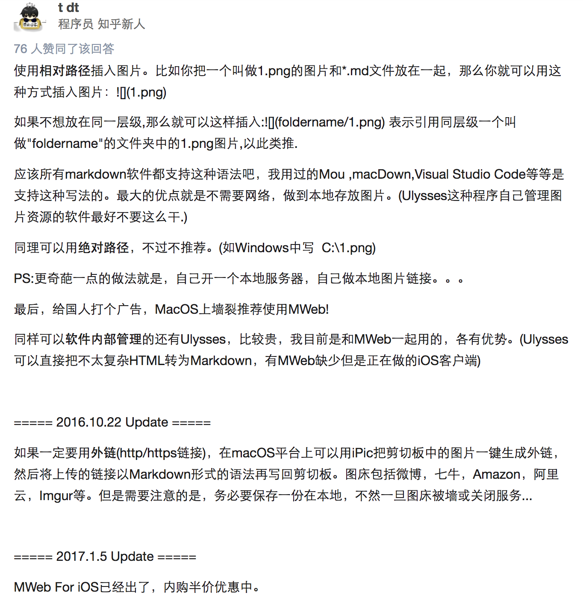
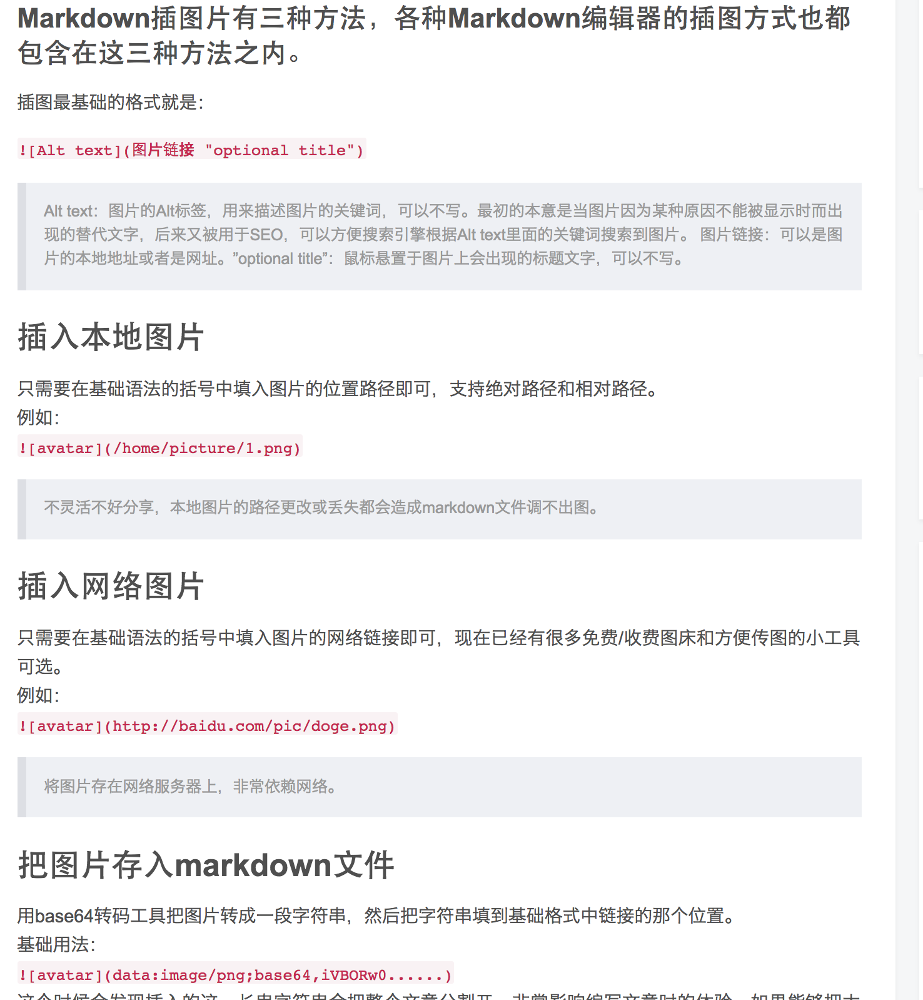

首先我要掌握怎么在git上加图片.
那么我来试试相对路径

> http://blog.csdn.net/slaughterdevil/article/details/79255933

> 1

> 2

>3

??为什么不显示???

> 4

     
[链接文本](链接地址)

 诶我突然发现git很适合存东西,仿佛云盘.
 然后如果使用bitbucket的话就是一个隐私云盘了.
 嗯,图片啥的很适合用诶

mp3啥的其实也是
就是懒的用

himiMacBookPro:G_MachineLearning_Note himi$ git branch --set-upstream-to=origin/<branch> master
-bash: branch: No such file or directory
himiMacBookPro:G_MachineLearning_Note himi$ git branch --set-upstream-to=origin/master master
Branch master set up to track remote branch master from origin.
himiMacBookPro:G_MachineLearning_Note himi$
himiMacBookPro:G_MachineLearning_Note himi$ git pull
error: Your local changes to the following files would be overwritten by merge:
	.idea/vcs.xml
Please, commit your changes or stash them before you can merge.
Aborting
himiMacBookPro:G_MachineLearning_Note himi$ git stash
Saved working directory and index state WIP on master: f9f68de first commit
HEAD is now at f9f68de first commit
himiMacBookPro:G_MachineLearning_Note himi$
himiMacBookPro:G_MachineLearning_Note himi$ git pull

太蠢受不了
明天再搞

写并列的list的时候

Markdown 支持有序列表和无序列表。

无序列表使用-、+和*作为列表标记：

- Red
- Green
- Blue

* Red
* Green
* Blue

+ Red
+ Green
+ Blue
效果如下：

1. Red
2. Green
3. Blue

**加粗文本** 或者 __加粗文本__

*斜体文本*  或者_斜体文本_

~~删除文本~~

***
---
___

* * *

https://www.jianshu.com/p/82e730892d42