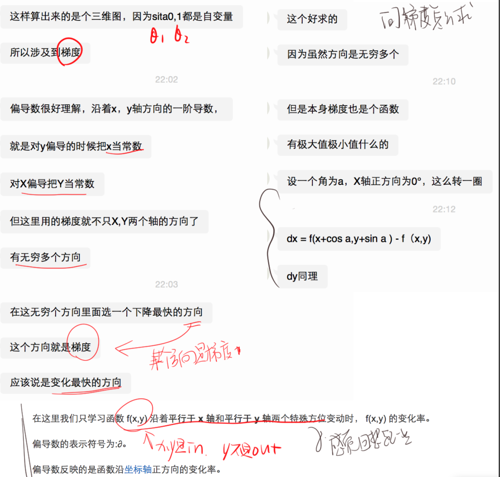
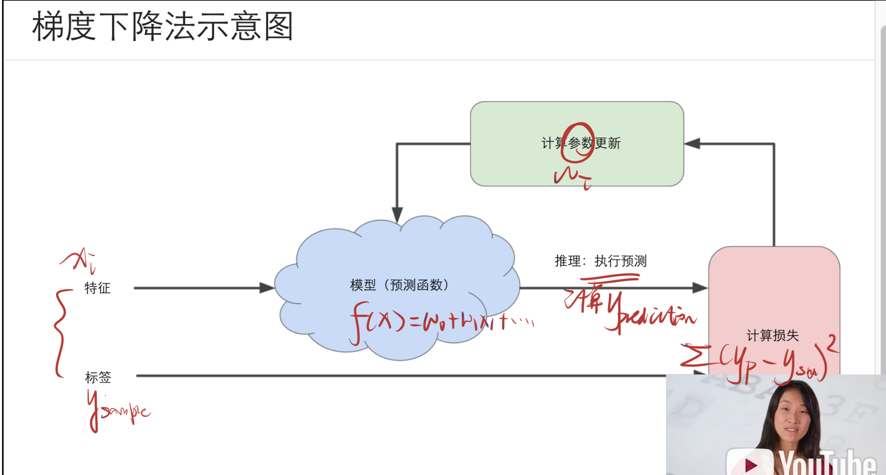
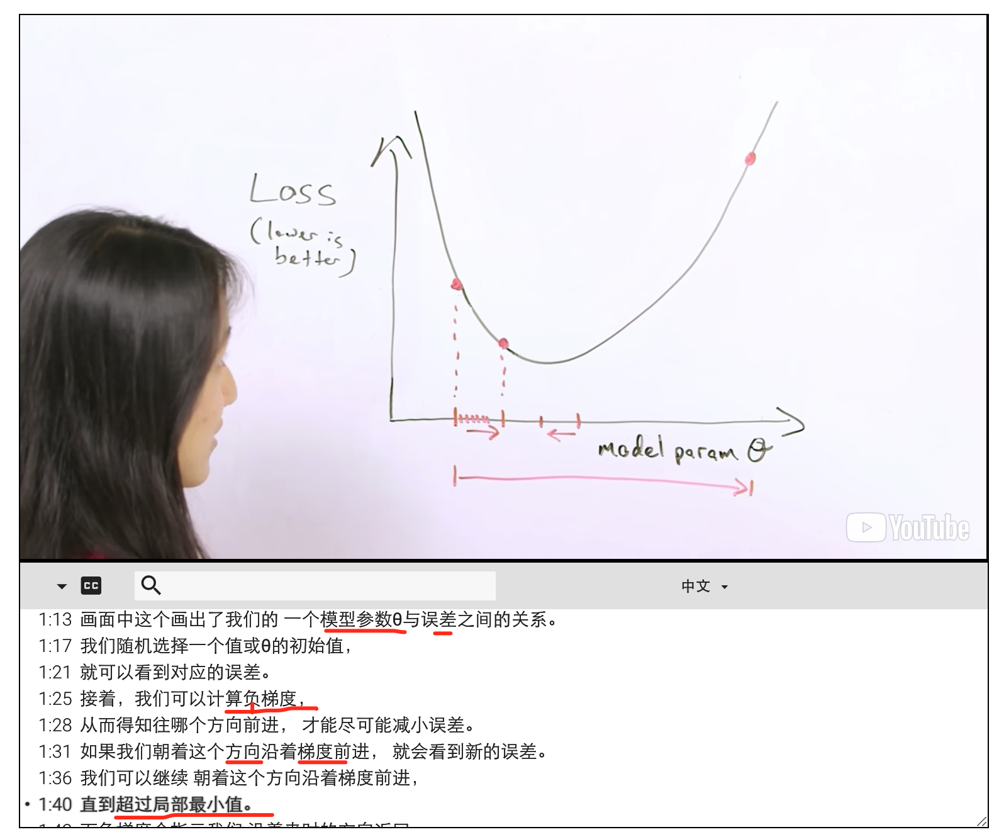
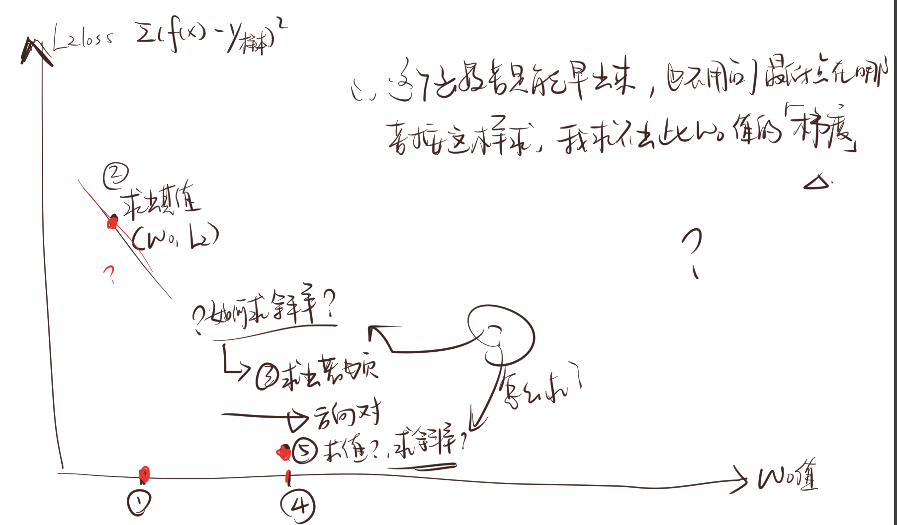
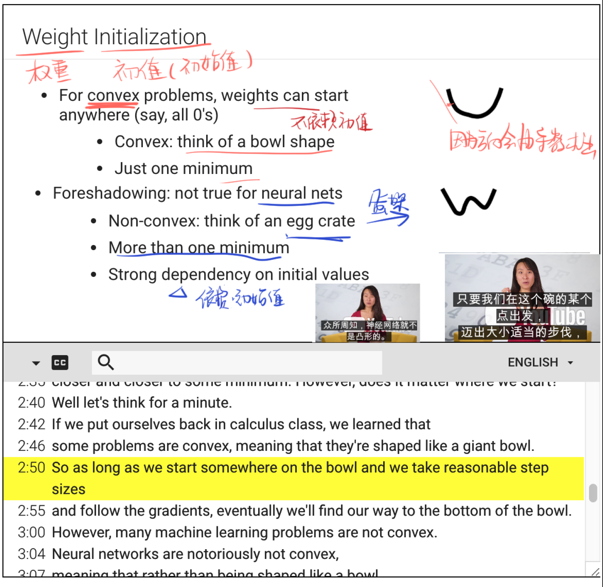

## 降低损失 Reducing Loss
为了训练模型，我们需要一种可降低模型损失的好方法。  
迭代方法是一种广泛用于降低损失的方法，而且使用起来简单有效。  

要换行要加两个空格??

--

- 了解如何使用迭代方法 iterative approach 来训练模型。
- 全面了解梯度下降法和一些变体，包括： full gradient descent and some variants
    - 小批量梯度下降法 mini-batch gradient descent
    - 随机梯度下降法  stochastic gradient descent
- 尝试不同的学习速率。 Experiment with learning rate.

首先为了便于理解  
~~其实梯度,叫梯度,就是斜率 ? 不是很严谨, 应该说是那个三角形x ⊿ 不是这个三角形,我打不出来.~~  
~~啊我不知道啥是梯度~~


## 如何选择模型参数the set of model parameters 来减小误差

每一个模型参数都对应一个不同的模型,然后用这个模型计算出相应的 预测值,求l2 误差  
所以不同参数 可以求不同的l2误差.

??那参数, w0 - wn 有很多啊  
是一个一个取还是一组一组取来测试呢

> 如果有 a direction to go in within parameter space 就很好

也就是想要一个参数往哪里走的方向.  
往正或者负.

> Some sort of guide such that each set of new -hyper-parameters- that we took on had a lower loss than the one before it.

每组超参数的误差都要比之前小 -> 好的

?? -hyper-parameters- 超参数? 是不是指代参数的合集而形成的一个杂交参数??


## 如何降低损失？

此次课程里以l2损失为衡量损失的数  
所以后面貌似都会是l2loss的计算方式
 
>(y - y')2 相对于权重和偏差的导数 可让我们了解指定样本的损失变化情况 Derivative of (y - y')2 with respect to the weights and biases tells us how loss changes for a given example

?? 相对与w0 和 w1 的导数?

> One way to get a direction is to compute the gradient.

> The derivative of the loss function (with respect to) (= about/ with ) the model parameters.

```
gradient? 中文字幕说是梯度?? 斜率
Derivative 是导数?
所以是 得到方向是计算斜率?
所以是计算模型的 l2loss的 导数? 把参数视作变量的求导数?
```

```
* gradient:
函数F(x,y,...)在(x0,y0,...)的梯度   就是函数在该点的导数 (?)，
通常在数学上记作▽F(x0,y0,...)或gradF(x0,y0,...)。

梯度是一个向量， 它的方向是函数在一点变化率最快的方向，而它的模就是函数沿这个方向的变化率。

在MATLAB中利用gradient计算梯度，将得到若干向量，它们指出了F的值增大的方向。

* 导数 Derivative
是微积分中的重要基础概念。
当函数y=f(x)的自变量x在一点x0上产生一个增量Δx时，函数输出值的增量Δy与自变量增量Δx的比值在Δx趋于0时的极限a如果存在，a即为在x0处的导数，记作f'(x0)或df(x0)/dx。

```

> 0:42	For simple loss functions like the square loss the derivative is easy to compute.

?? 为什么容易算出导函数?

> 0:47	And it gives us an efficient way to update model parameters.

- 易于计算且为凸形 (x)  
  Simple to compute and convex  
↑我觉得这是翻译问题,应该是下凹....这个中文教程真的没问题么???

- 因此，我们在能够尽可能降低损失的方向上反复采取小步  
So we repeatedly take small steps in the direction that minimizes loss

- 我们将这些小步称为梯度步长（但它们实际上是负梯度步长  
We call these Gradient Steps (But they're really negative Gradient Steps)  
↑这翻译真的是这样么?  
why not 斜率步长??  

- 这种优化策略称为梯度下降法  
This optimization strategy is called Gradient Descent  

应该是斜率下降法? 啊受不了,真的是叫梯度啊.不就是斜率 不就是导数么怎么这么扯淡  


感觉可以算算的一个:  
https://baike.baidu.com/item/%E6%A2%AF%E5%BA%A6%E4%B8%8B%E9%99%8D/4864937?fr=aladdin


## 梯度
https://coding.net/u/metaquant/p/blog/topic/360699  
图片中有  
>  梯度可以定义为一个函数的全部偏导数构成的向量(这一点与偏导数与方向导数不同，两者都为标量)。

> 事实上，梯度向量的方向即为函数值增长最快的方向  

> 简而言之，梯度是偏导数的矢量；  
它可以让您了解哪个方向距离目标“更近”或“更远”。

?? 偏导数?? 

> 请注意，梯度是一个矢量，因此具有以下两个特征：  
- 方向
- 大小
梯度始终指向损失函数中增长最为迅猛的方向。  
梯度下降法算法会沿着负梯度的方向走一步，以便尽快降低损失  




## 梯度下降法示意图

 iterated approach.  
 反复的过程 - 迭代法
 




计算数据的梯度(斜率)  
负斜率会 告诉我们更新模型参数的方向

因为l2 loss 的函数上某点的斜率/导数为负,就表示,这个点之后往下走,就好比加速度为负,速度减小.
所以才向负的方向走

然后往那个方向走一步之后, 再次计算斜率  

* 斜率
    * 正的, 往回走
    * 负的, 向之后算
    * 负得越小, 越接近0, 应该是约距离最小误差近
    
    *? 为什么是只有一个最小的峰? 为什么w0和loss是只有一个峰
    *? 真的并不能得到那个函数啊, 所以这个loss函数到底怎么来的,也就是说每次

?????
不太明白先后关系  





- diverge 偏离

--  

## Weight Initialization 初始值




## SGD & Mini-Batch Gradient Descent SGD 和小批量梯度下降法

- Could compute gradient over entire data set on each step,  
but this turns out to be unnecessary
- Computing gradient on small data samples works well
    - On every step, get a new random sample

- Stochastic Gradient Descent: one example at a time  
随机梯度下降法  ：一次抽取一个样本  

- Mini-Batch Gradient Descent: batches of 10-1000
    - Loss & gradients are averaged over the batch  损失和梯度在整批范围内达到平衡  
  小批量梯度下降法：每批包含 10-1000 个样本


## 学习速率 步长 梯度

```
正如之前所述，梯度矢量具有方向和大小。
梯度下降法算法用 [梯度] 乘以 [一个称为学习速率（有时也称为步长）的标量] ，以确定下一个点的位置。
```

> 例如，如果梯度大小为 2.5，学习速率为 0.01  
则梯度下降法算法会选择距离前一个点 0.025 的位置作为下一个点。

梯度带着方向,乘上标量就是方向不变长度改变的一个向量.

```
超参数是编程人员在机器学习算法中用于调整的旋钮。
大多数机器学习编程人员会花费相当多的时间来调整学习速率。
```

梯度是各个偏导的向量和
偏导就是在某一个维度/变量的 导数


有解了!!


## 关于高纬度之间角度的问题


